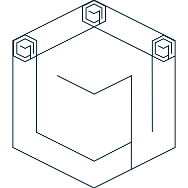

<p align="center">
  <a href="" rel="noopener">
 </a>
</p>

<h3 align="center">DEEDs</h3>

<div align="center">


</div>

---

🤖 Distributed Encrypted Ephemeral Data Storage System (based on GFS)

## 📝 Table of Contents

- [📝 Table of Contents](#-table-of-contents)
- [🧐 About ](#-about-)
- [🎥 Demo / Working ](#-demo--working-)
- [💭 How it works ](#-how-it-works-)
- [🎈 Usage ](#-usage-)
- [🏁 Getting Started ](#-getting-started-)
  - [Prerequisites](#prerequisites)
  - [Installing](#installing)
- [🚀 Deploying your own bot ](#-deploying-your-own-bot-)
- [⛏️ Built Using ](#️-built-using-)
- [✍️ Authors ](#️-authors-)
- [🎉 Acknowledgements ](#-acknowledgements-)

## 🧐 About <a name = "about"></a>

DEEDs is a distributed encrypted ephemeral data storage system based on the Google File System (GFS). It is designed to store data in a distributed manner, encrypt it and then delete it after a certain period of time.

## 🎥 Demo / Working <a name = "demo"></a>

TODO: Add demo
<!--  -->

## 💭 How it works <a name = "working"></a>

TODO: Add implementation details

## 🎈 Usage <a name = "usage"></a>

TODO: Add usage instructions with examples

## 🏁 Getting Started <a name = "getting_started"></a>

These instructions will get you a copy of the project up and running on your local machine for development and testing purposes. See [deployment](#deployment) for notes on how to deploy the project on a live system.

### Prerequisites

What things you need to install the software and how to install them.

```
TODO: Add prerequisites
```

### Installing

TODO: Add installation instructions

<!-- A step by step series of examples that tell you how to get a development env running.

Say what the step will be

```
Give the example
```

And repeat

```
until finished
```

End with an example of getting some data out of the system or using it for a little demo. -->

## 🚀 Deploying your own bot <a name = "deployment"></a>

TODO: Add deployment instructions

## ⛏️ Built Using <a name = "built_using"></a>

TODO: Add technologies used

## ✍️ Authors <a name = "authors"></a>

TODO: Add authors

## 🎉 Acknowledgements <a name = "acknowledgement"></a>

<!-- - Hat tip to anyone whose code was used -->
- Inspiration
- References
