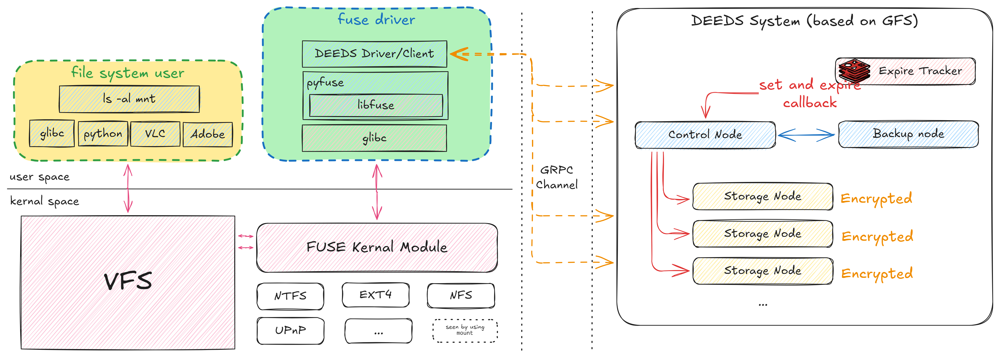

# Distributed Encrypted Ephemeral Data Storage System (DEEDS)

Nitheesh Chandra Y, Mohammed Omer <br/>
International Institute of Information Technology Hyderabad, India

## Abstract

Ephemeral data storage systems are crucial in addressing the growing need for secure, temporary, and compliant data management. Despite the availability of scalable distributed file systems, such as the Google File System (GFS), they lack integrated features for secure encryption and automated data expiration both essential for meeting modern regulatory requirements like GDPR and HIPAA. This project introduces the Distributed Encrypted Ephemeral Data Storage System (DEEDS), a novel approach combining encryption and expiration mechanisms directly within a distributed architecture. DEEDS employs a master-chunk server model with built-in expiration strategies—passive checks during regular access and active deletion during idle states—to manage the data lifecycle seamlessly. ~~Furthermore, the system integrates file-level AES encryption to ensure data confidentiality without sacrificing performance.~~(Differed due to time) DEEDS is implemented as a FUSE-based file system, providing users with a seamless and intuitive interface. Initial results highlight its potential for efficient, secure, and regulation-compliant ephemeral storage. Future work includes optimizing scalability, expanding geographic replication, and testing under real-world conditions.

---

## Related Work
The foundation of the Distributed Encrypted Ephemeral Data Storage System (DEEDS) lies in existing research and practical implementations of distributed file systems, encryption techniques, and compliance-driven data management. This section reviews the most relevant works that influence and contextualize the design of DEEDS.

### Distributed File Systems
The Google File System (GFS) [1] introduced a scalable and fault-tolerant architecture for managing large datasets across distributed storage systems. While highly influential, GFS lacks integrated mechanisms for ephemeral data management and secure encryption. Similarly, HDFS (Hadoop Distributed File System) [2] builds on the GFS design but prioritizes scalability and fault tolerance over data lifecycle management, leaving expiration and encryption responsibilities to external systems.

### Data Expiration Mechanisms
Expiration mechanisms are well-studied in in-memory key-value stores like Redis [3], which uses passive checks during data access and active garbage collection for expired keys. However, these methods are not directly transferable to distributed file systems due to differences in data structure and access patterns. Systems like Memcached adopt a similar approach but provide limited granularity and no integration at the file system level.

### Encryption in Storage Systems
Secure file systems like EFS (Encrypted File System) [4] and Cryptfs [5] implement encryption at the file system layer, ensuring data confidentiality. However, they are primarily designed for single-node setups and do not address challenges associated with distributed systems. Perlman’s Ephemerizer [6] introduces mechanisms to make data “disappear” after a certain period, but its focus is on theoretical guarantees rather than practical implementation in distributed environments.

### Compliance and Data Protection
Recent studies, such as Shah et al. [7], examine the implications of GDPR on storage systems, emphasizing the importance of automated expiration and secure data deletion. Chidambaram et al. [8] explore software-defined data protection as a pathway to achieving regulatory compliance, highlighting the potential for integrating compliance mechanisms into the storage layer.

### Filesystem Virtualization
FUSE (Filesystem in Userspace) [9] provides an abstraction layer for implementing custom file systems with minimal kernel-level interactions. XFUSE [10] extends this concept, enabling rapid prototyping and development of user-space file systems with specialized features like DEEDS.

---

## Methodology
The Distributed Encrypted Ephemeral Data Storage System (DEEDS) combines principles of distributed file systems, encryption, and automated expiration to deliver a secure, scalable, and regulation-compliant temporary storage solution. This section details the architectural components, data lifecycle management strategies, encryption implementation, and system integration approach.



### System Architecture
DEEDS is modeled on the master-chunk server architecture inspired by the Google File System (GFS). The architecture consists of the following components:

1. **Master Node**

 Maintains metadata, including chunk locations, encryption keys, and expiration timestamps.
Manages system coordination, ensuring data integrity and enforcing expiration policies.
Chunk Servers
2. **Store encrypted file chunks.**

 Perform local expiration checks during read/write operations (passive expiration).
Participate in periodic system-wide garbage collection tasks to remove expired chunks (active expiration).

3. **FUSE Interface**

 Provides a user-space file system interface, enabling users to mount DEEDS as a standard file system.
Handles operations like file creation, reading, writing, and deletion seamlessly for the end user.

4. **Garbage Collector**

 Implements active expiration by scanning for expired chunks during idle periods.
Coordinates with the master node to ensure expired data is removed efficiently and securely.

### Data Lifecycle Management

1. Expiration Mechanisms

 To ensure automatic and timely deletion of data, DEEDS employs two complementary strategies:

    **Passive Expiration**:
Expiration checks are triggered during regular file operations (e.g., reads, writes). Chunk servers verify expiration timestamps and deny access to expired files, signaling the master node for metadata updates.

 **Active Expiration**:
Chunk servers perform periodic scans to identify and delete expired data. The garbage collector, managed by the master node, coordinates these scans to optimize system performance and avoid conflicts.

2. Expiration Metadata
The expiration timestamp is stored alongside file metadata in the master node and chunk servers. It ensures synchronization between access requests and garbage collection operations.

## Encryption Implementation (Incomplete. Deferred due to time constraints)
DEEDS ensures data confidentiality through file-level encryption using AES (Advanced Encryption Standard).

- Key Management

 Encryption keys are generated per file and managed by the master node.
Keys are distributed to chunk servers only during authorized operations, ensuring minimal exposure.
Encryption Workflow

 During file creation, the client encrypts data using a randomly generated AES key.
Encrypted data is divided into chunks and stored across chunk servers.
Upon file access, authorized clients receive decryption keys from the master node after authentication.
End-to-End Security

Data remains encrypted at rest and in transit between chunk servers and clients.
Expired data chunks are securely deleted, with keys removed from the master node to ensure irrecoverability.

### System Integration

1. FUSE-Based Interface
The system uses FUSE (Filesystem in Userspace) to provide an intuitive interface for users. The FUSE module maps file system calls (e.g., read, write, unlink) to the underlying DEEDS architecture, enabling seamless interaction.

2. Synchronization Between Components

The master node and chunk servers synchronize metadata using lightweight communication protocols using GRPC to minimize latency.
Garbage collection activities are scheduled to avoid conflicts with ongoing file operations.

3. Testing and Performance Optimization

Unit and integration tests validate the functionality of encryption, expiration, and data retrieval processes.
Simulated workloads evaluate system performance under various access patterns and expiration settings.


## Implementation Details

### Technologies Used

- **Programming Language**: Python, C++
- **Libraries**: FUSE, gRPC
- **Networking**: GRPC
- **Database**: Redis
- **Tools**: Docker, Kubernetes

Secure Delete Algorithm

```python
def secure_delete(file):
    with open(file, "ba+") as delfile:
 length = delfile.tell()
 delfile.seek(0)
 delfile.write(os.urandom(length))
 delfile.flush()
 os.fsync(delfile.fileno())
 delfile.truncate()
 delfile.close()
 os.remove(file)
```

No hash recalculations are done for the file. It is overwritten with random data and then deleted, ensuring it's not recoverable.

## Discussion

The integration of automated expiration mechanisms directly into the file system represents a significant advancement in ephemeral data management. DEEDS demonstrates the potential for applications in secure collaboration, temporary storage of sensitive research data, and regulatory compliance. Limitations include initial scalability constraints, which will be addressed in future work.

## Future Work

- **Geographic Replication**: Extend DEEDS for distributed environments across multiple data centers.
- **Advanced Access Control**: Implement role-based access control with encryption policies.
- **Real-World Testin**g: Deploy in production-like environments to validate performance under high loads.

## Conclusion
DEEDS offers a robust and innovative approach to managing ephemeral data in distributed environments. Its combination of encryption, expiration mechanisms, and user-friendly interfaces ensures security, compliance, and usability. Future enhancements will further establish DEEDS as a critical tool for organizations prioritizing data protection and regulatory adherence.
